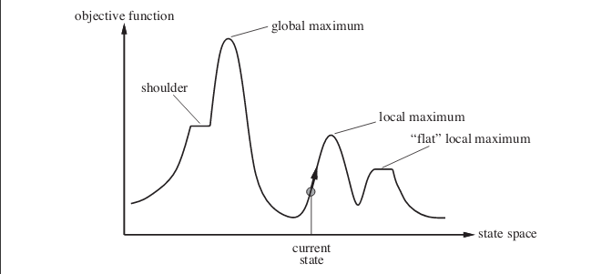
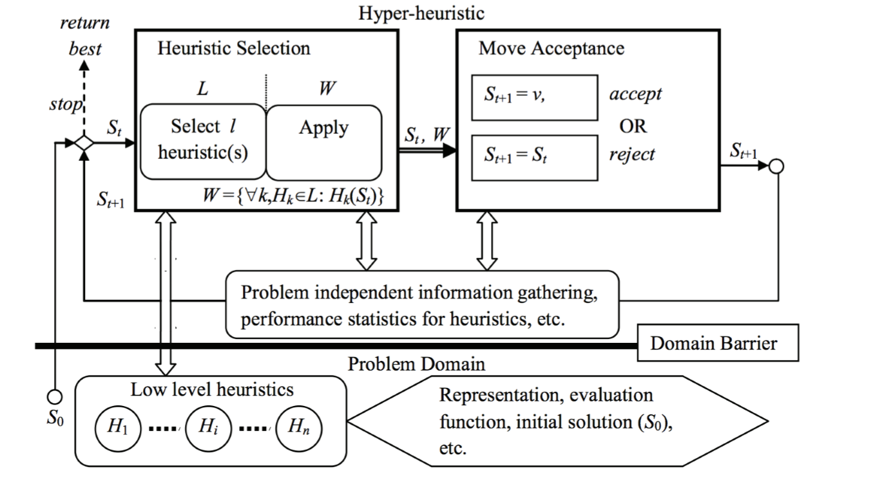
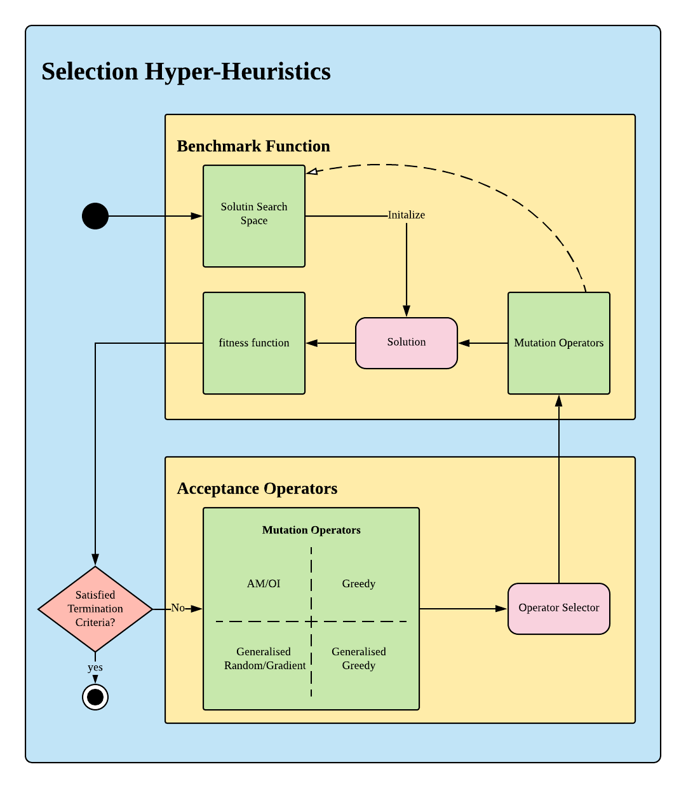
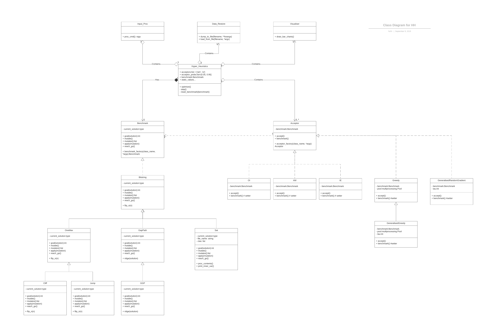
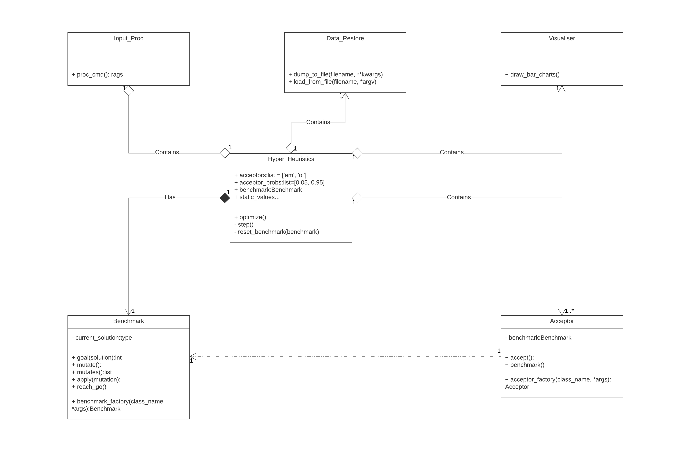
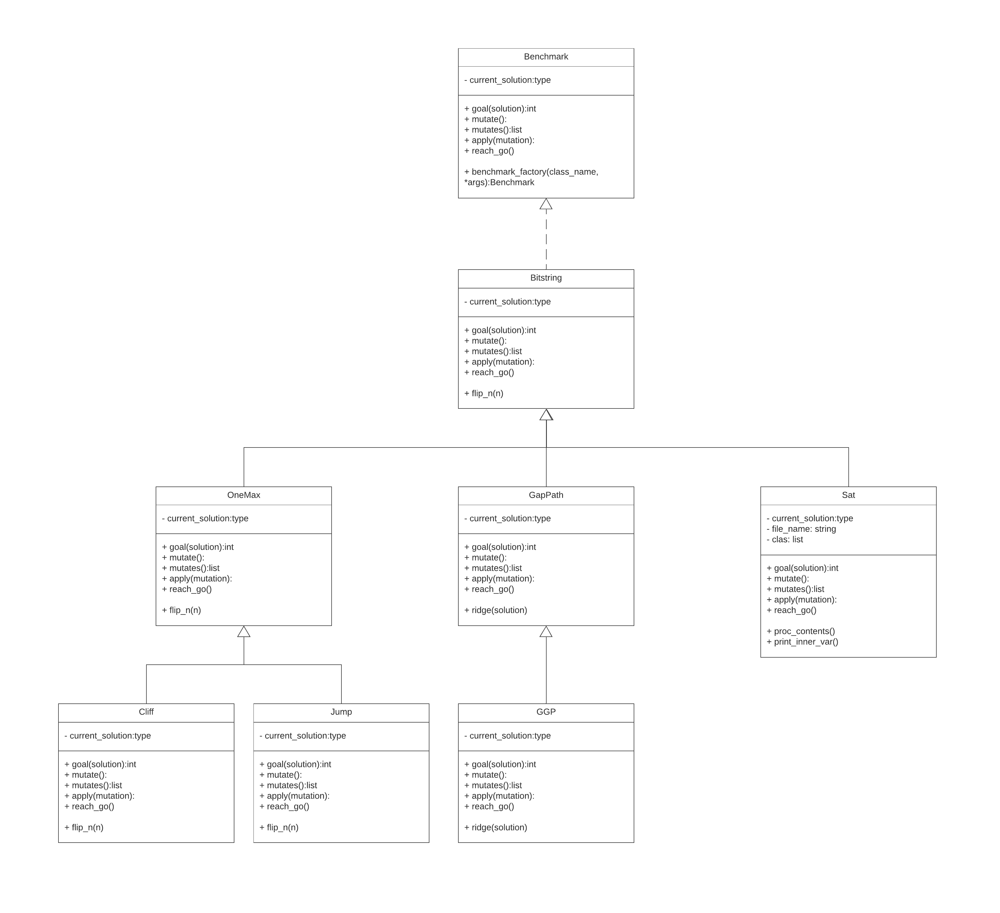
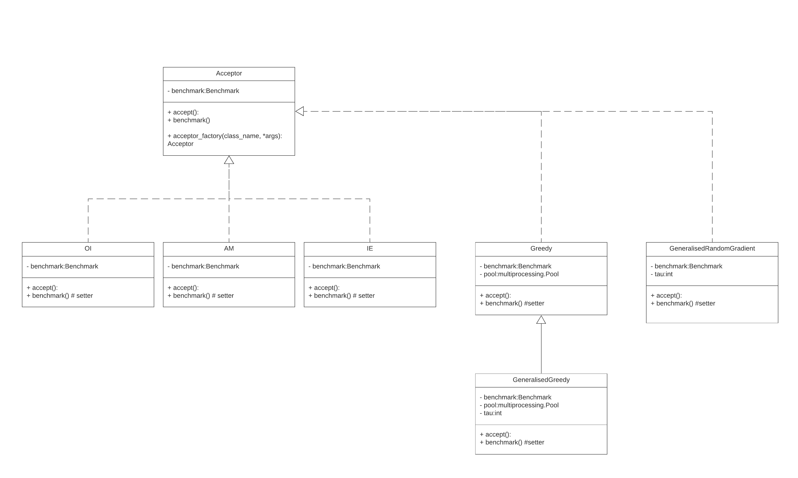

# Hyper Heuristics Framework - A Framework to Generate Meta-Heuristics

This project produces a hot-pluggable framework that could generate thereotical any kind of meta-heuristic algorithm such as evolutionary algorithm and simulating annealing algorithm. Any kind of combinationary optimisation problem could be test on this platform to find out the best problem-solving method by adjusting parameters in the framework.

----

## Get Started

### Prerequisites

To install this project, you could simply download it by:

```
git clone https://github.com/forfrt/Hyper_Heuristic_Framework.git
```

### Test

The entrance point of the project is located in `main.py`, the usages of it are described as follow:

```
USAGE: <PROGNAME> [-h] [-b BENCHMARK] [-s]
               [--benchmark_params [BENCHMARK_PARAMS [BENCHMARK_PARAMS ...]]]
               [--sat_files SAT_FILES] [--acceptors ACCEPTORS [ACCEPTORS ...]]
               [--acceptor_probs ACCEPTOR_PROBS [ACCEPTOR_PROBS ...]]
               [--max_mutation MAX_MUTATION] [--num_run NUM_RUN]
               [--log_file LOG_FILE] [--dump_file DUMP_FILE] [-s]

OPTIONS:
  -h, --help            show this help message and exit
  -b BENCHMARK, --benchmark BENCHMARK
                        BENCHMARK : the benchmark to be tested on (Benchmark
                        in {OneMax, Cliff, Jump, Sat, GapPath default: Sat}
  --benchmark_params [BENCHMARK_PARAMS [BENCHMARK_PARAMS ...]]
                        benchmark problem parameters if one of [OneMax, Cliff,
                        Jump] is selected
  --sat_files SAT_FILES
                        CNF files if SAT benchmark is selected
  --acceptors ACCEPTORS [ACCEPTORS ...]
                        a list of acceptors chosen to be selected
  --acceptor_probs ACCEPTOR_PROBS [ACCEPTOR_PROBS ...]
                        probabilities of given acceptors
  --max_mutation MAX_MUTATION
                        maximum number of mutation
  --num_run NUM_RUN     number of run for each problem instance
  --log_file LOG_FILE   logging file
  --dump_file DUMP_FILE
                        file that store the json.dumps() result
  -s, --show            show the statistic bar chart based on pervious data
  
```

Therefore, you could run the project by adding appropriate options. For example, to test a hyper-heuristic parameter setting on some MAX-SAT problem instances, you could use:


```

python main.py -b sat --sat_files ./satlib/uf75 --num_instance 5 --num_run 5 --acceptor_probs 0.0133 0.9866 --max_mutation 100000000 --log_file ./log/uf75_test.log --dump_file ./log/uf75_test.dump > ./log/uf75_test.print

```


Besides, You could also create your shell script to run multiple test or use provided script by:

```
bash ./batch_test.sh
```

----

## Introduction

### Combinatorial Optimization Problems

Combinatorial optimization is a topic that consists of finding an optimal object from a finite set of objects, optimization problems in which the feasible solutions are discrete and can be expressed using concepts from combinatories (such as sets, subsets, combinations or permutations) and/or graph theory (such as vertices, edges, cliques, paths, cycles or cuts). Some simple and classic problems are shown as follows:

1. Job-shop Scheduling (JSP): given n jobs of varying processing times, we need to be scheduled on m machines with varying processing power, while trying to minimize the makespan.
1. Knapsack problem: Given a set of items, each with a weight and a value, determine the number of each item included in a collection so that the total weight is less than or equal to a given limit and the total value is as large as possible.
1. The Traveling Salesman Problem: given the (x, y) positions of N different cities, find the shortest possible path that visits each city exactly once. 



### Selection Hyper Heuristics

To solve the NP-hard problem that exists in every corner in engineering, the approaches to get the result that is considered close enough to the global optima in polynomial time, heuristics, are getting more and more attention. However, there are still some difficulties to apply them to a newly encountered problem:

1. Select which particular search heuristic should be used.
2. What parameter setting should be applied.

As a result, hyper-heuristics found a place to overcome those difficulties. Seen as a high-level methodology, the hyper-heuristics automatically provides an adequate combination of the provided components to solve the given problem field efficiently.



----

## Structure

### Overall Structure



### Class Diagram

our implementation would contain a framework and two hot-plugging modules. This structure naturally involves the interaction between different components and would perfectly suit for object-oriented programming paradigm (abbreviated as OOP). The OOP programming paradigm packs related data and procedures into an object and uses its inner procedures to modify the data fields of the object. As a result, the paradigm would design a program by creating objects first and interact with them to finish the specific task. With OOP paradigm, our program is design as follow: 



As the figure is shown, the framework is consist of six modules:

1. Hyper-Heuristics control module 
1. Benchmark module
1. Acceptance operator module
1. Input processing module
1. Data restore module
1. Visualiser module

We will go deep into each module in the later sections:

### Hyper-Heuristics Control Module

The Hyper-Heuristics framework control module is implemented as `Hyper\_Heuristics` class . As its name implies, it acts as the main control component to interact with all other modules in our program. The control module will first receive the parameters passed from the input processing module to initialise its data fields. In detail, the data field `benchmark` will be initialised with exactly one benchmark problem instance that inherits from Benchmark virtual interface. The acceptance operator list `acceptors` will be assigned with at least one acceptance operator that inherits the acceptance operator virtual interface while its probability will be initialised to the data field `acceptor\_probabilities`. After initialisation, it will use `optimize()` function to start the procedure described in previous algorithm and invoke `step()` function every time to iterate. The statistic data collected during execution would be saved by the data restore module to a specified file. Finally, the visualiser module would use the collected data to drawbar charts for visualisation.



### Benchmark Function Module 

Combinatorial optimisation aims to find the global optima in the search space of a particular problem by definition. Therefore, all combinatorial optimisation problems would have a global optima and search space to search for feasible solutions. Besides, those problems should also have methods to mutate from a feasible solution to another one. In addition, some acceptance operators such as elitism and greedy operator would need fitness function to decide their choice. Therefore, we created a virtual benchmark function interface that has the following properties:

1. `current\_solution`. This attribute denotes the current solution for this benchmark function. Our goal is to optimize the current solution to the optimal solution.
2. `goal(solution)`. This function gives the fitness value of solution.
3. `mutates()`. This function returns a list of mutation function that could find neighbouring solution of current solution.
4. `mutate(mutate\_fun\_name, *args)`. This function would invoke the a mutation operator function specified by \texttt{mutate\_fun\_name} with \texttt{*args} as its parameters.
5. `apply(mutation)`. This function apply the mutation caused by a mutation operator function to the current solution.
6. `reach\_go()`. This function returns whether the current solution is the global optima or not. The control module described in \ref{control_module} uses the result of this function as a termination condition.
7. `benchmark\_factory`. This static method is designed as a factory method to generate a instance of all combinatorial optimisation problem.

All types of combinatorial optimisation problem could inherit from the interface and override the properties with their own implementation. Due to the time limit, we have only implemented bit-string benchmark problems for our experiment. A special function called `flip\_n(n)` is created to return a function that flip n bit randomly in a bit-string instead of values. Three types of bit-string benchmark problems are developed in the program and they all use the function return by `flip\_n(1)` and `flip\_(2)` as their mutation operators. All problem classes are featured by their measurements but they all belong to 0-1 integer programming problems. We will introduce them respectively in the later sections.

You could also add new benchmark functions as long as they are combinatorial optimisation problem by developing a new class inherited from `Benchmark` class.



### Acceptor Function Module 

The acceptance operator module also implements a virtual interface to enable the capability to use all types of acceptance operator with our program. The common behaviors of acceptance operators are extracted as the \code{accept()} function to determine the mutation operators to evaluate and accept. All acceptance operators we implemented could are classified by two dimension: 

1. The decision criteria to accept a mutation.
1. The number of steps the accepted mutation operator will apply for.



You could also add new benchmark functions as long as they are combinatorial optimisation problem by developing a new class inherited from `Acceptor` class.


### More Details

You could find more details in the docs folder.


----

## Future work and Contact

Despite works we have done,  there are still some restricts in our algorithm.  Our hyper-heuristic can not generate all metaheuristic algorithms such as evolutionary algorithm, which should generate by the definition.  Besides, the project only implemented algorithms can only test on 0-1 integer programming problems with flip random bit operator. 

Since the benchmark function and acceptance operator moduels are designed hot-plugging. We could solve the previous problems by:
1. Add new types of benchmark functions by implementing class from abstract benchmark interface.
2. Add a cross-breeding operator so we could generate evolutionary algorithm.

Other works including more potential acceptance operators and architecture adjust, feel free to contact [me](forfrt@gmail.com) if you are interested in this project.


